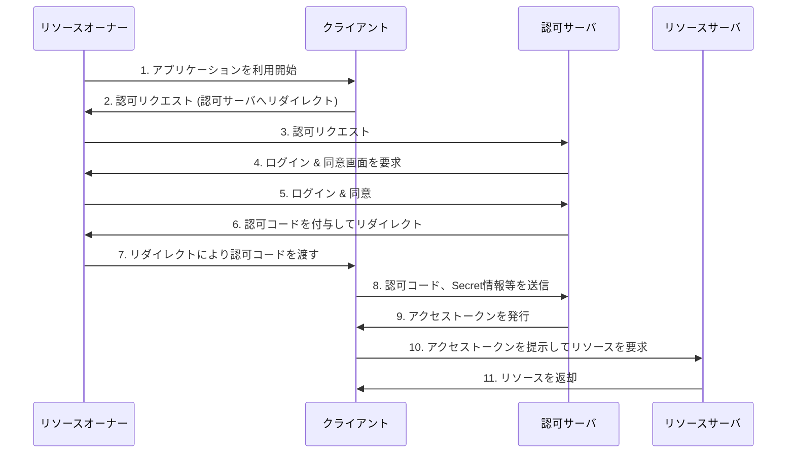

# OAuth 2.0

## OAuth 2.0の4つの主要な要素

- **クライアント**:
    - アプリケーション(フロント、バックエンドどちらの可能性もある)
    - `{認可サーバ}`へリダイレクトにより`{アクセストークン}`の発行をリクエストし、発行された`{アクセストークン}`を用いてリソースサーバ内のリソース取得を行う。

- **認可サーバ**:
    - アクセストークンを発行するサーバ
    - クライアントからのアクセストークン発行リクエストをトリガーとし、`{リソースオーナー}`に対してクライアントがリソースへアクセスする権限を与えるかを聞く。権限を与える場合、`{クライアント}`に対してアクセストークンを発行する。

- **リソースオーナー**:
    - リソースの所有者(基本的にはユーザー)
    - `{クライアント}`に対して、自身のリソースへのアクセスを許可する権限を与える。

- **リソースサーバ**:
    - 保護されたリソースをホストするサーバ
    - クライアントから提示された`{アクセストークン}`を検証し、正当であればリソースへのアクセスを許可する。

## OAuth 2.0の認可フロー

1. **認可リクエスト**:
    - クライアントが認可サーバの特定のエンドポイントにリダイレクトさせる。
    - リクエスト送信時、`{response_type}`, `{client_id}`, `{redirect_uri}`, `{scope}`などのパラメータを`{QueryString}`に付与する。
    - **具体的なリダイレクト処理**:
        - クライアントは、ユーザーのブラウザに対して、認可サーバの認可エンドポイントへのリダイレクトを指示するHTTPレスポンス（通常はHTTP 302 Foundステータスコードと`{Location}`ヘッダ）を返します。
        - ユーザーのブラウザがそのHTTPレスポンスを受け取り、`{Location}`ヘッダに指定された認可サーバのURLへ自動的にアクセスします。
        - この時、クライアントアプリケーションのバックエンドが直接認可サーバにリクエストを送信するわけではなく、**ユーザーのブラウザを介して**認可サーバへリクエストが送られます。

2. **リソースオーナーの同意**:
    - リソースオーナーは`{認可サーバ}`上で認証(ログイン)し、クライアントに要求された権限(スコープ)を与えることに同意する。

3. **認可コードの払い出し**:
    - 認可サーバは、リソースオーナーをクライアントの`{redirect_uri}`にリダイレクトさせます。
    - リダイレクト時、`{QueryString}`に`{認可コード}`を付与します。

4. **アクセストークンのリクエスト**:
    - クライアントは受け取った`{認可コード}`を使い、認可サーバのトークン発行用エンドポイントにリクエストを送信します。

5. **アクセストークンの発行**:
    - 認可サーバは認可コードを検証し、問題がなければクライアントに`{アクセストークン}`と、場合によっては`{リフレッシュトークン}`を発行します。

6. **リソースへのアクセス**:
    - クライアントは取得した`{アクセストークン}`を使って、リソースサーバに保護されたリソースを要求します。

