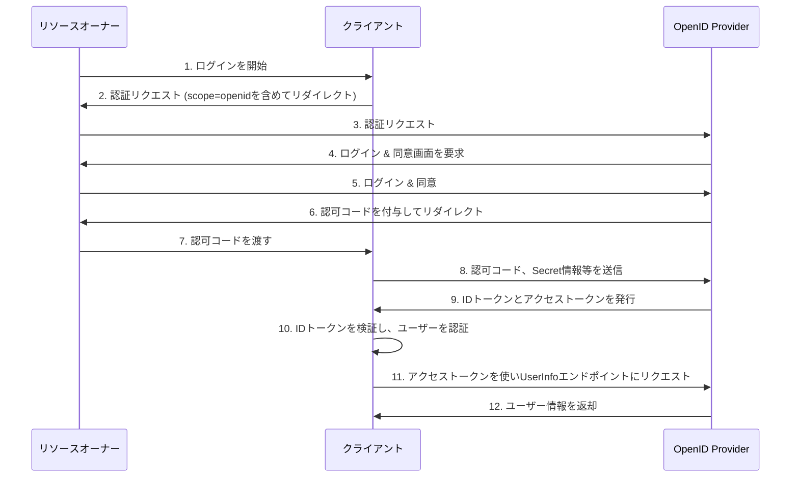

# OpenID Connect

OIDCはOAuth 2.0の上に構築された認証のためのプロトコルです。

## OIDCの主な拡張点

- IDトークン:
    - ユーザーの認証情報を`{JWT}`形式で表現したもの。
    - クライアントは`{JWT}`を検証することで、ユーザーが誰であるかを知ることができる。
    OAuthの`{scope}`に`{openid}`を含めることで、IDトークンが返されるようになる。

- UserInfoエンドポイント:
    - IDトークンに含まれる情報だけでは足りない場合に、追加のユーザー情報を取得するためのエンドポイント。
    - このエンドポイントへのアクセスはアクセストークンが必要です。

## OIDCのフロー:

OIDCのフローは、OAuth 2.0のフローをベースにしています。最も一般的に利用されるのは、OAuth 2.0の認可コードフローを拡張した**認可コードフロー**です。

1.  **認証リクエスト**:
    - クライアントは、OAuth 2.0の認可リクエストに加えて、`{scope}`パラメータに`{openid}`を含めて認可サーバにリクエストを送信します。
    - `{response_type}`には`{code}`を指定します。

2.  **ユーザーの認証と同意**:
    - ユーザーは認可サーバ上で認証（ログイン）し、クライアントに要求された情報（scopeで指定）を提供することに同意します。

3.  **認可コードの払い出し**:
    - 認可サーバは、ユーザーをクライアントの`{redirect_uri}`にリダイレクトさせ、`{QueryString}`に認可コードを付与します。

4.  **トークンリクエスト**:
    - クライアントは受け取った認可コードを使い、認可サーバのトークンエンドポイントにリクエストを送信します。このリクエストには、クライアントIDとSecretも含まれます。

5.  **IDトークンとアクセストークンの発行**:
    - 認可サーバは認可コードを検証し、問題がなければクライアントに**IDトークン**と**アクセストークン**を発行します。

6.  **IDトークンの検証とユーザー情報の取得**:
    - クライアントは受け取ったIDトークンの署名を検証し、改ざんされていないことを確認します。
    - 検証後、IDトークンのペイロードからユーザーの識別子（subクレームなど）やその他の情報を取得し、ユーザーを認証します。

7.  **リソースへのアクセス（任意）**:
    - クライアントは、必要に応じて、取得したアクセストークンを使ってUserInfoエンドポイントやその他のリソースサーバにアクセスし、追加のユーザー情報を取得します。

