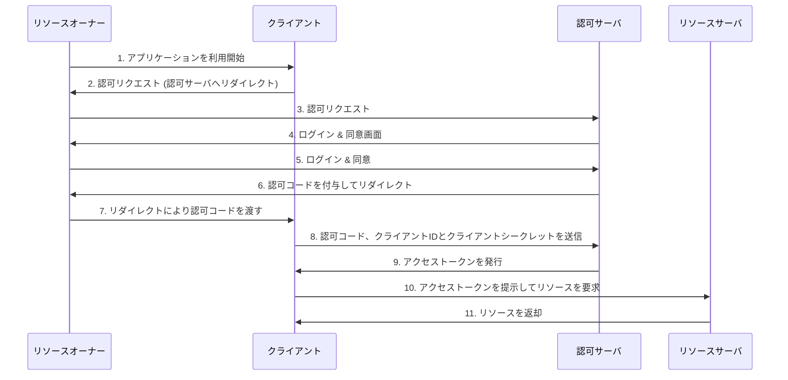

# OAuth 2.0

OAuth 2.0 は、リソース所有者（ユーザー）に代わってクライアント（アプリ）がリソースサーバにアクセスするための**認可**を与える仕組みを定めたプロトコルです。

## OAuth 2.0の4つの主要な要素

- **クライアント**:
    - 保護されたリソースへのアクセスを要求するアプリケーション。Webアプリケーションの場合、フロントエンド(公開クライアント)またはバックエンド(機密クライアント)が該当する。
    - ユーザー(リソースオーナー)を`[____]`へリダイレクトさせることで認可を求め、払い出された`[____]`を使って`[____]`の発行をリクエストする。発行された`[____]`を用いてリソースサーバ内のリソース取得を行う。

- **認可サーバ**:
    - アクセストークンを発行するサーバ
    - クライアントからの認可リクエストを受け、`[____]`の認証と同意を得た上で、`[____]`に対して`[____]`を発行する。

- **リソースオーナー**:
    - リソースの所有者であり、一般的にはエンドユーザーを指す。
    - `[____]`に対して、自身のリソースへのアクセス権限を与える(または拒否する)役割を担う。

- **リソースサーバ**:
    - 保護されたリソースをホストするサーバ
    - クライアントから提示された`[____]`を検証し、正当であればリソースへのアクセスを許可する。

## OAuth 2.0の認可フロー

1. **認可リクエスト**:
    - クライアントは`[____]`を`[____]`の認可エンドポイントへリダイレクトさせる。
    - リクエスト送信時、どのようなレスポンスか(`[____]`), どのクライアントからの要求化(`[____]`), 認可コード払い出し後にどこにリダイレクトさせるか(`[____]`), どのような権限を要求するか(`[____]`)などのパラメータを`[____]`に付与する。
    - **具体的なリダイレクト処理**:
        - クライアントは、ユーザーのブラウザに対して、認可サーバの認可エンドポイントへのリダイレクトを指示するHTTPレスポンス（通常はHTTP 302 Foundステータスコードと`[____]`ヘッダ）を返します。
        - ユーザーのブラウザがそのHTTPレスポンスを受け取り、`[____]`ヘッダに指定された`[____]`のURLへ自動的にアクセスします。
        - この時、クライアントアプリケーションのバックエンドが直接認可サーバにリクエストを送信するわけではなく、**ユーザーのブラウザを介して**認可サーバへリクエストが送られます。

2. **リソースオーナーの認証と同意**:
    - `[____]`は`[____]`に対して認証(ログイン)を要求し、クライアントに要求された権限(スコープ)へのアクセスを許可するかどうかの同意を求めます。

3. **認可コードの払い出し**:
    - リソースオーナーが同意すると、認可サーバはリソースオーナーをクライアントの`[____]`にリダイレクトさせます。
    - リダイレクト時、`[____]`に一時的な`[____]`を付与します。

4. **アクセストークンのリクエスト**:
    - クライアントは受け取った`[____]`を使い、自身の`[____]`と`[____]`と共に、認可サーバのトークンエンドポイントにアクセストークンの発行リクエストを送信します。

5. **アクセストークンの発行**:
    - `[____]`は認可コードを検証し、問題がなければクライアントに`[____]`と、場合によっては`[____]`を発行します。

6. **リソースへのアクセス**:
    - クライアントは取得した`[____]`をヘッダに含めて、リソースサーバに保護されたリソースを要求します。

