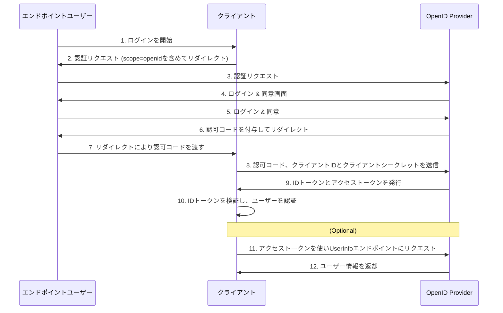

# OpenID Connect

OIDCは、OAuth 2.0を拡張して**認証**を実現するためのプロトコルです。
OAuth 2.0が「認可」(何ができるか)を合う買うのに対し、OIDCは「認証」(誰であるか)を扱います。

OIDCでは、OAuth 2.0の要素が以下のように呼ばれることがあります。

- **OpenIDプロバイダ(OP)**: `[____]`に相当し、ユーザー認証を行い、IDトークンを発行します。
- **リライングパーティ(RP)**: `[____]`に相当し、OPに対してユーザー認証を要求し、その結果を受け取ります。

## OIDCの主な拡張点(OAuth 2.0との違い)

- **IDトークン**:
    - ユーザーの認証情報を`[____]`形式で表現したもの。
    - RPはIDトークンの署名を検証することで、ユーザーがOPによって認証されたことを確認し、ユーザーの識別子(subクレーム)などを取得できます。
    - OAuth 2.0の認可リクエストの`[____]`に`[____]`を含めることで、IDトークンが発行されるようになる。

- **UserInfoエンドポイント**:
    - IDトークンには基本的な情報しか含まれない場合に、追加のユーザー情報を取得するためのエンドポイントです。このエンドポイントへのアクセスにはOAuth 2.0の`[____]`が必要です。

## OIDCのフロー:

OIDCのフローは、OAuth 2.0の認可コードフローがベースとなります。
OAuth 2.0のフローにIDトークンの取得と検証が加わった形です。

1.  **認証リクエスト**:
    - RPは、OAuth 2.0の認可リクエストの`[____]`パラメータに`[____]`を追加して、ユーザーをOPへリダイレクトさせます。
    - `[____]`には`[____]`を指定します。

2.  **ユーザーの認証と同意**:
    - ユーザーはOP上で認証（ログイン）し、RPに情報を提供することに同意します。

3.  **認可コードの払い出し**:
    - OPはユーザーをRPの`[____]`にリダイレクトさせ、`[____]`に認可コードを付与します。

4.  **トークンリクエスト**:
    - RPは受け取った`[____]`を使い、OPの`[____]`にリクエストを送信します。このリクエストには、`[____]`と`[____]`も含まれます。

5.  **IDトークンとアクセストークンの発行**:
    - OPは`[____]`を検証し、問題がなければRPに`[____]`と`[____]`を発行します。ここがOAuth 2.0との大きな違いです。

6.  **IDトークンの検証とユーザー情報の取得**:
    - RPは受け取った`[____]の署名や有効期限などを検証し、改ざんされていないことを確認します。
    - 検証後、IDトークンのペイロードからユーザーの識別子（subクレーム）を取得し、RP側のセッションを開始するなどしてユーザーを「ログイン済み」として扱います。

7.  **UserInfoエンドポイントへのアクセス（任意）**:
    - RPは、必要に応じて、取得したアクセストークンを使ってUserInfoエンドポイントやその他のリソースサーバにアクセスし、追加のユーザー情報を取得します。

